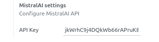

 

Mistral AI Connector
=================

This technical module provides a connector for the Mistral AI API.

It can be used as a playground to test Mistral AI tools in Odoo but does not have standalone functionality.
The module is intended to be inherited by other modules for specific use cases, such as: 
 - [mistralai_chat](../mistralai_chat/README.md): Adds a Mistral AI Bot user to chat with in Odoo.

To create custom Mistral AI completions refer to the API documentation for proper configuration of API parameters. 

[Mistral AI API Documentation](https://beta.mistralai.com/docs/api-reference/introduction)

## Configuration

Create an account on [https://mistral.ai/](https://mistral.ai/)

Generate your API key: [API keys](https://console.mistral.ai/user/api-keys/)

In **Settings**, fill the **API Key** field with your generated key.

## Usage

### Mistral AI Completion

To create a new **Mistral AI Completion**, go to **Settings**, **Technical**, **Mistral AI Completion** and create a new record.

**Model**: The model on witch the completion will be applied.

**Target Field**: The field where the generated value will be saved.

**Domain**: The domain to select the records on witch the completion will be run.

Check the [API Documentation](https://docs.mistral.ai/api/) to set **Mistral AI Parameters** values.

For Completion results go to **Settings**, **Technical**, **Mistral AI Completion Results**

### Prompt template

Write a prompt template in Qweb.

Available functions in prompt template:
 - object : Current record
 - answer_lang : Function returning the language name
 - html2plaintext : Function to convert html to text

### Tests

Test actions use the first record of the model selected by the domain.

Test first your prompt to adjust your template, then test the result of the Completion to adjust Mistral AI parameters.

## Requirements

This module requires the Python client library for Mistral AI API

    pip install mistralai>=0.0.11

## Maintainer

* This module is maintained by [Michel Perrocheau](https://github.com/myrrkel). 
* Contact me on [LinkedIn](https://www.linkedin.com/in/michel-perrocheau-ba17a4122). 

