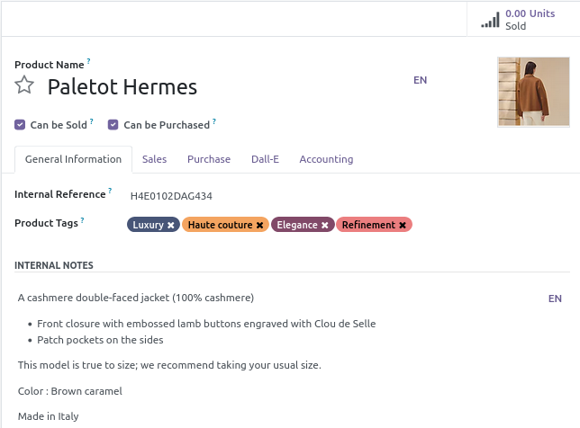
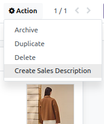
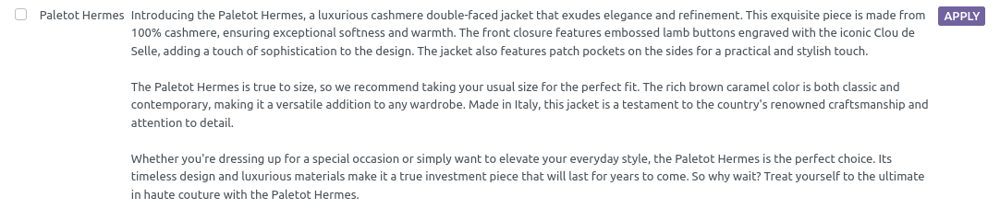
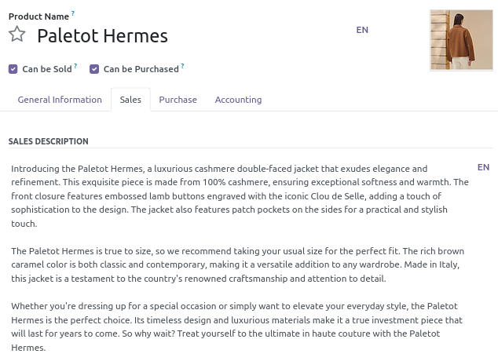

 

Mistral AI Product Description
==========================

This module allows to generate a product sales description with Mistral AI from product tags, attributes or any other product information.

## Usage

On a product, select **Create Sales Description** action (This action is also available from the product list view):

click on Clic on **Apply** to save the generated text as the product sales description.

## Requirements

[mistralai_connector](../mistralai_connector/README.md) is required. 

This module requires the Python client library for Mistral AI API

    pip install mistralai

## Maintainer

* This module is maintained by [Michel Perrocheau](https://github.com/myrrkel). 
* Contact me on [LinkedIn](https://www.linkedin.com/in/michel-perrocheau-ba17a4122). 

