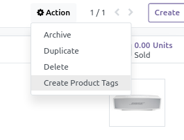
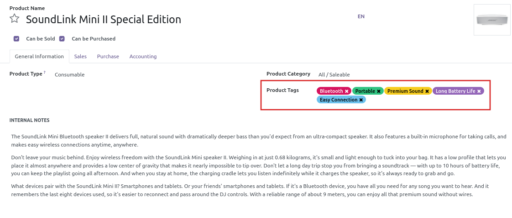

 

Mistral AI Product Tags
===================

This module allows to generate tags from product's description with Mistral AI models.

## Usage

On a product, select **Create Product Tags** action :

Tags are generated from **Internal Notes**:

This action is also available from the product list view.

## Requirements

[mistralai_connector](../mistralai_connector/README.md) is required. 

This module requires the Python client library for Mistral AI API

    pip install mistralai

## Maintainer

* This module is maintained by [Michel Perrocheau](https://github.com/myrrkel). 
* Contact me on [LinkedIn](https://www.linkedin.com/in/michel-perrocheau-ba17a4122). 

